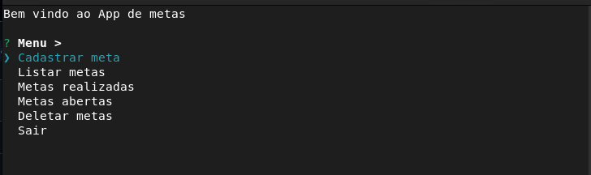
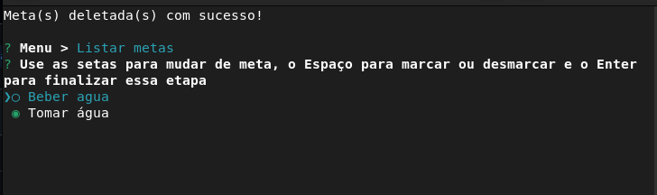

# 🎯 goal-tracker-cli

> A simple **command-line interface (CLI) application** built with Node.js to manage and track your personal goals. You can add, list, and mark goals as completed, with all data saved locally in a JSON file.

---

## 🚀 Overview

`goal-tracker-cli` was developed during a learning journey to practice JavaScript and Node.js.  
It uses the **Inquirer** library to create an interactive terminal experience and stores data in a JSON file for persistence.

---

## 🛠️ Features

- Add new personal goals
- List existing goals
- Mark goals as completed
- Persist data locally in `metas.json`
- User-friendly interactive CLI

---

## 📂 Project Structure

```

goal-tracker-cli/
│── index.js          # Main CLI logic
│── metas.json        # Local storage for goals
│── package.json      # Dependencies and scripts
│── todo.md           # Notes and tasks

````

---

## ⚙️ Technologies

- **Node.js**
- **Inquirer.js** (`@inquirer/prompts`)
- **File System (fs)` for persistence

---

## ▶️ How to Run

1. Clone the repository:
   ```bash
   git clone https://github.com/SEU_USUARIO/goal-tracker-cli.git
   cd goal-tracker-cli
   ```

2. Install dependencies:

   ```bash
   npm install
   ```

3. Run the CLI:

   ```bash
   node index.js
   ```

---

## 📸 Screenshots





---

## 🛤️ Roadmap

* [ ] Add support for categories of goals
* [ ] Add due dates
* [ ] Export goals to Markdown or CSV
* [ ] Cloud sync option

---

## 👨‍💻 Author

Developed by **Josias de Hollanda Caldas Netto**
[LinkedIn](https://www.linkedin.com/in/josiasnetto) | [GitHub](https://github.com/JosiasNetto)


